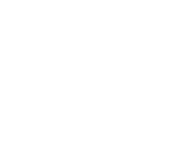

<div align="center">
  
<h1>MyPizza</h1>


  <p>
    <a href="https://github.com/nathalyadev/mypizza/graphs/contributors">
      
    </a>
    <a href="">
      
    </a>
    <a href="https://github.com/nathalyadev/mypizza/network/members">
      
    </a>
    <a href="https://github.com/nathalyadev/mypizza/stargazers">
      
    </a>
    <a href="https://github.com/nathalyadev/mypizza/issues/">
      
    </a>
    <a href="https://github.com/nathalyadev/mypizza/blob/master/LICENSE">
      
    </a>
  </p>
    

</div>

# :star2: Sobre o projeto
Landing Page de pizzaria com dados fictícios 
## :camera: Layout do projeto


### :compass: Ajustes e melhorias

O projeto ainda está em desenvolvimento e as próximas atualizações serão voltadas nas seguintes tarefas:

- [x] Arrumar imagem da seção Header
- [ ] Arrumar Input e textarea
- [ ] Adicionar mapa por meio de APIs
- [ ] Adicionar modal da seção PizzaList
- [ ] Adicionar efeito hover nos botões

## :space_invader: Tecnologias utilizadas

- VueJs
- JavaScript

## Project setup

```
npm install
```

### Compiles and hot-reloads for development

```
npm run serve
```

### Compiles and minifies for production

```
npm run build
```

<h2 align="center">Autor</h2>
<p align="center">Nathálya Lima </p>
